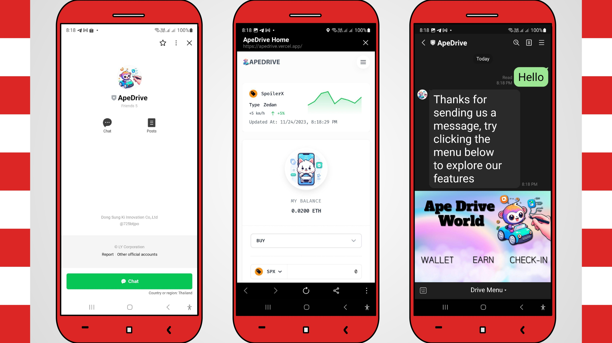
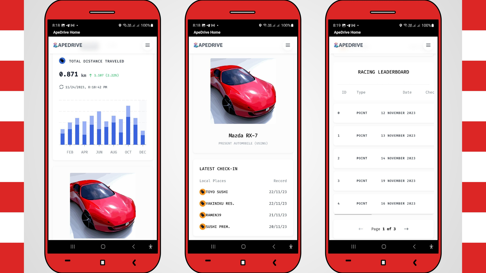
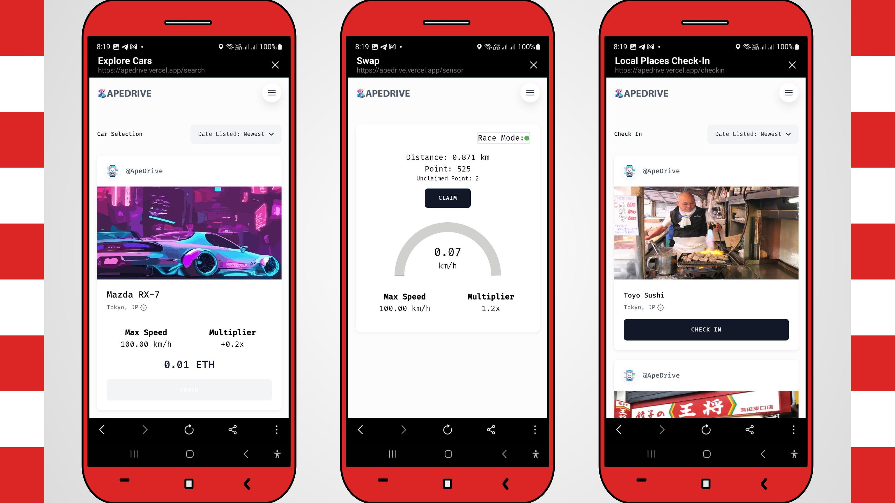
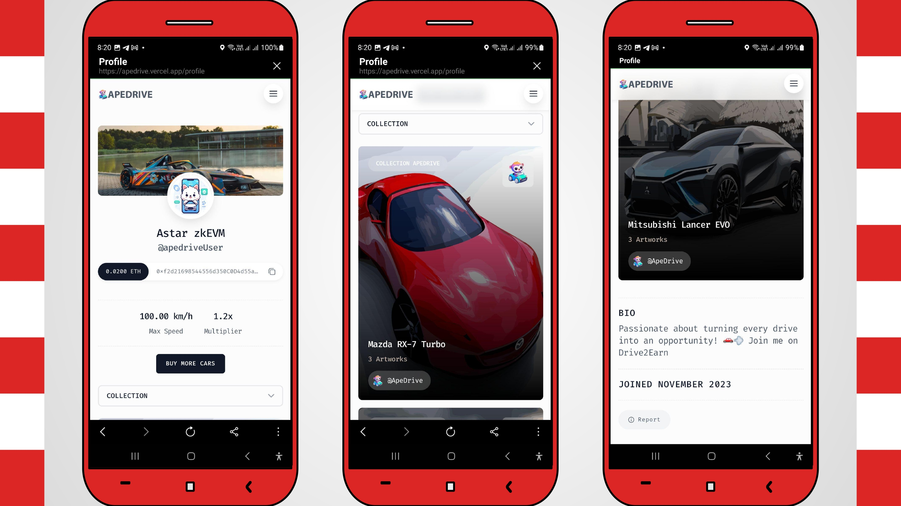

# Ape Drive Project

## Overview

Ape Drive is a groundbreaking platform that transforms the driving experience into an immersive and rewarding journey. By blending mobile GPS technology, NFTs, Astar zkEVM blockchain with Web3 integration, and a LINE Chatbot interface, Ape Drive offers users a unique and gamified approach to their daily drives.

### What it does

- Real-time tracking of acceleration, velocity, and distance for token earnings.
- NFT marketplace for upgrading virtual cars, and enhancing speed limits.
- LINE Chatbot integration for seamless user interaction.

### The problem it solves

Ape Drive addresses the monotony of traditional driving and encourages safe practices, community exploration, and collaboration with local businesses.

### Challenges Faced

- Integration complexity of multiple technologies.
- Robust smart contract development on Astar zkEVM blockchain.
- User-friendly LINE Chatbot interface design.

## Technologies Used

- Mobile GPS Technology
- Astar zkEVM Blockchain (zKatana Testnet)
- NFT Marketplace
- Web3 Integration (Ether.js, Nextjs, TailwindCSS)
- LINE Chatbot

## Sample UI

## Websites

* **Smart Contract**: https://github.com/johnnyduo/apedrive_contract
* **Live Demo**: https://apedrive.vercel.app
* **Demo Video**: https://www.youtube.com/watch?v=zqn8vx7wxxI
* **Demo Video (Desktop)**: https://www.veed.io/view/5ecc356a-2a26-458e-a168-c6763dde43da?panel=share

## Contracts

We have deployed our smart contracts on zKatana testnet

Smart contract source code is available at https://github.com/johnnyduo/apedrive_contract

* ApeDrive Point: [0xEa527C018A22f11F717BabFE26eCeC256DE4A7C8](https://zkatana.blockscout.com/address/0xEa527C018A22f11F717BabFE26eCeC256DE4A7C8)
* ApeDrive Car: [0x1ca2cF4a5795a7877848402C5726cE00D1864bA2](https://zkatana.blockscout.com/address/0x1ca2cF4a5795a7877848402C5726cE00D1864bA2)
* ApeDrive Stamp: [0xD696ed39733B54D369b74B0b1e24cb54e9Cb8CE4](https://zkatana.blockscout.com/address/0xD696ed39733B54D369b74B0b1e24cb54e9Cb8CE4)
